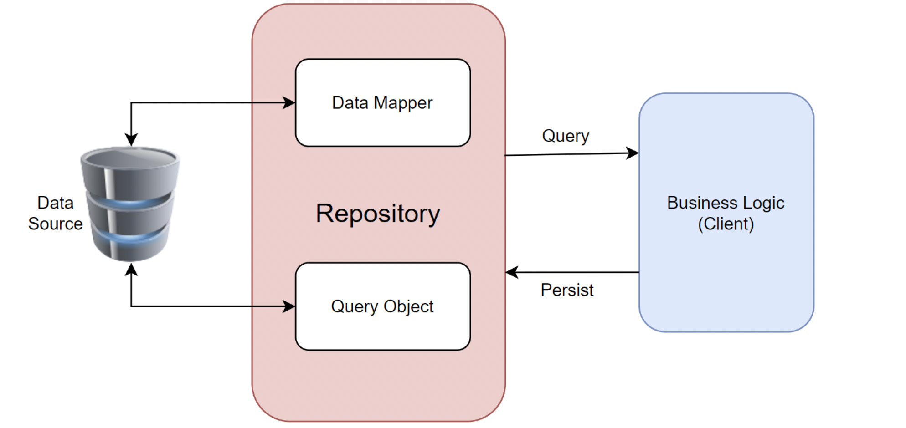

= Intro to Ecto
:author: Keith Lancaster, Ph.D.
:icons: font
:source-highlighter: highlight.js

== Overview
* Repository Pattern
* SQL Basics Review
* Ecto Basics

== Repository Pattern

== SQL Queries in PgAdmin Demo
* Basic CRUD operations in SQL

[.centered-left-justified-large]
[source,sql]
----
-- Create
insert into users(last_name, first_name, inserted_at,updated_at)
values('Brown', 'Bill','2022-01-01','2022-01-01')

-- Read
select * from users where last_name = 'Brown'

-- Update
update users set last_name='Blue' where id=1

-- Delete
delete from users where id = 1
----

== Ecto CRUD Equivalents
* These Ecto functions generate the SQL appropriate for the configured database

[.centered-left-justified-large]
[source, elixir]
----
Repo.insert %User{...} # create a new user

Repo.all(User) # select * from users;

Repo.get(User,1) # select * from users where id=1

Repo.update changeset # update users set...

Repo.delete u# delete from users where user_id = u
----

== Inserting Records in Ecto
* Records can be inserted directly using Repo
* Constraints in the database are enforced, however, direct insertions are not validated against the application constraints

[source, elixir]
----
iex(32)> Repo.insert user
[debug] QUERY OK db=1.8ms queue=1.7ms idle=1661.7ms
INSERT INTO "users" ("inserted_at","updated_at") VALUES ($1,$2) RETURNING "id" [~N[2022-03-03 17:12:37], ~N[2022-03-03 17:12:37]]
{:ok,
 %AccountManager.Accounts.User{
   __meta__: #Ecto.Schema.Metadata<:loaded, "users">,
   first_name: nil,
   id: 11,
   inserted_at: ~N[2022-03-03 17:12:37],
   last_name: nil,
   updated_at: ~N[2022-03-03 17:12:37]
 }}
----
* Notice that the first_name and last_name are both missing, even though they are required by the Phoenix app

== Database Constraints
* Adding a contraint directly using pgAdmin

* Error returned by Ecto when constraint is violated

== Adding Column Constraints using Ecto
* Setting the not null constraint in the migration

[source,elixir]
[.centered-left-justified-large]
----
add :first_name, :string, null: false
----

* Column contraints are added when the table is created, and can be modified later
* _Table_ constraints can be added at any time. They can be complex and operate on multiple columns

[source,elixir]
[.centered-left-justified-large]
----
  def change do
    create constraint(:users, :first_name_exists, check: ~s|(first_name is not null)|)
  end
----

== Validations and the Changeset
[.centered-left-justified-large]
* Ecto changesets are used to prepare data prior to inserting or updating records on the client side

[source,elixir]
[.centered-left-justified-large]
----
  def changeset(user, attrs) do
    user
    |> cast(attrs, [:last_name, :first_name]) # returns a changeset
    |> validate_required([:last_name, :first_name]) #
  end
----
* There are quite a number of validations available "out of the box". Documentation can be found at https://hexdocs.pm/ecto/3.7.0/Ecto.Changeset.html

== Ecto.Changeset.cast

* `cast` returns an `Ecto.Changeset` includes a field `valid?` 
** A changeset is marked as invalid if the data types do not match (passing in a number when a string was required, etc.)

[source, elixir]
[.centered-left-justified-large]
----
iex(16)> cs = cast(u,%{first_name: 123},[:first_name])     
#Ecto.Changeset<
  action: nil,
  changes: %{},
  errors: [first_name: {"is invalid", [type: :string, validation: :cast]}],
  data: #AccountManager.Accounts.User<>,
  valid?: false
>
----

== Getting Specific Results
* In SQL, we use the `where` clause to filter our results

[source, sql]
[.centered-left-justified-large]
----
select * from users where last_name = 'Lancaster'
----

* The equivalent query in Ecto

[source, elixir]
[.centered-left-justified-large]
----
import Ecto.Query
query = from u in User, where: last_name == "Lancaster" 
Repo.all(query)
----

== Composable Queries

* In SQL, we can use `and` to filter to limit the results of the query

[source, sql]
[.centered-left-justified-large]
----
select * from users where last_name = 'Lancaster' and first_name = 'Joshua'
----

* Ecto queries are _composable_, so we can do this

[source, elixir]
[.centered-left-justified-large]
----
query = from u in User, where: last_name == "Lancaster" 
query2 = from q in query, where: q.first_name == "Joshua"
Repo.all(query2)
----